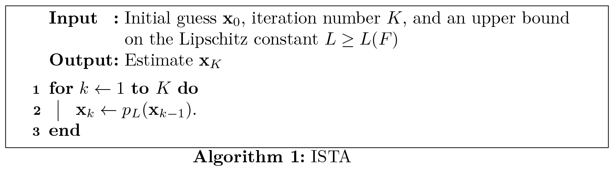
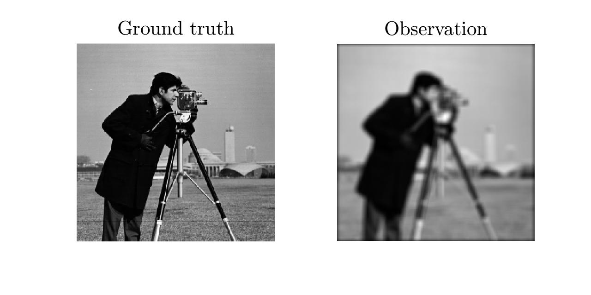

# Iterative shrinkage / thresholding algorithms (ISTAs) for linear inverse problems

**Author:** [Yunhui Gao](https://github.com/Yunhui-Gao) (gyh21@mails.tsinghua.edu.cn)

A simple MATLAB implementation of the **iterative shrinkage / thresholding algorithms (ISTAs)** for solving linear inverse problems of the form:
$$
\mathop{\mathrm{min}}\limits_{\mathbf{x}} \left\{ J(\mathbf{x}) \equiv \frac{1}{2}\|\mathbf{Ax - y}\|_2^2 + \lambda r(\mathbf{x}) \right\}.
$$


## Table of contents

- [Preliminaries](#preliminaries)
  - [Proximal gradient method](#proximal-gradient-method)
  - [Interpretation](#interpretation)
  - [ISTA and its variants](#ista-and-its-variants)
    - [ISTA](#ista)
    - [FISTA](#fista)
    - [TwIST](#twist)
  - [Proximity operators](#proximity-operators)
    - [Proximity operator for the $l_1$ regularizer](#proximity-operator-for-the-l_1-regularizer)
    - [Proximity operator for the TV regularizer](#proximity-operator-for-the-tv-regularizer)
  - [Line search and monotonicity](#line-search-and-monotonicity)
- [Core functions](#core-functions)
  - [`ISTA.m`](#istam)
  - [`FISTA.m`](#fistam)
  - [`TwIST.m`](#twistm)
- [Examples](#examples)
  - [Example 1: LASSO regression](#example-1-lasso-regression)
  - [Example 2: Image deblurring](#example-2-image-deblurring)
- [References](#references)


## Preliminaries

### Proximal gradient method

Consider the following convex optimization problem:
$$
\mathop{\mathrm{min}}\limits_{\mathbf{x}} \left\{ J(\mathbf{x}) \equiv F(\mathbf{x}) + R(\mathbf{x}) \right\}, \tag{1}
$$
where $F(\mathbf{x})$ and $R(\mathbf{x})$ are both convex functions, but different in that $F(\mathbf{x})$ is smooth whereas $R(\mathbf{x})$ is not. One common approach to problem $(1)$ is the **proximal gradient method**, which adopts an updating rule given by<a href="#ref-1"><sup>1</sup></a> 
$$
\mathbf{x}_{k+1} = \mathrm{prox}_{\gamma_k R} \left( \mathbf{x}_k - \gamma_k \nabla F(\mathbf{x}_k) \right), \tag{2}
$$
where $\mathrm{prox}_{\gamma R} (\cdot)$ denotes the **proximity operator** for function $R(\mathbf{x})$ with parameter $\gamma$:
$$
\mathrm{prox}_{\gamma R}(\mathbf{v}) = \mathop{\mathrm{argmin}}\limits_{\mathbf{x}} \left\{ R(\mathbf{x}) + \frac{1}{2\gamma} \|\mathbf{x - v}\|_2^2 \right\}. \tag{3}
$$


For **linear inverse problems**, we limit our scope to the following type of problems:
$$
\mathop{\mathrm{min}}\limits_{\mathbf{x}} \left\{ J(\mathbf{x}) \equiv \frac{1}{2}\|\mathbf{Ax - y}\|_2^2 + \lambda r(\mathbf{x}) \right\}, \tag{4}
$$
where $F(\mathbf{x}) = 1/2\|\mathbf{Ax - y}\|_2^2$ is the data-fidelity term, and $R(\mathbf{x}) = \lambda r(\mathbf{x})$ is the regularization term with parameter $\lambda$. 

Strictly speaking, the **iterative shrinkage / thresholding algorithm (ISTA)** refers to the proximal gradient algorithm for solving problem $(4)$ with $r(\mathbf{x}) = \|\mathbf{x}\|_1$. While we consider regularization terms other than the $l_1$ norm, we still refer to the more generalized algorithm as ISTA.

### Interpretation

Here we present an interpretation for the proximal gradient algorithm, which is helpful for further discussions. We consider the following quadratic approximation with parameter $L$:
$$
Q_L(\mathbf{x},\mathbf{y}) := F(\mathbf{y}) + \langle \mathbf{x-y}, \nabla F(\mathbf{y}) \rangle + \frac{L}{2} \left\| \mathbf{x - y} \right\|_2^2 + R(\mathbf{x}). \tag{5}
$$
If $L$ is no less than the Lipschitz constant of $F$, that is if we have $L \geq L(F)$, then $Q_L(\mathbf{x},\mathbf{y})$ is a upper bound to $J(\mathbf{x})$. In fact, we have
$$
Q_L(\mathbf{x},\mathbf{y}) \geq J(\mathbf{x}), \forall \mathbf{x}, \qquad \textrm{and} \qquad Q_L(\mathbf{y},\mathbf{y}) = J(\mathbf{y}). \tag{6}
$$
Therefore, $Q_L(\mathbf{x},\mathbf{y})$ is the majorizer of $J(\mathbf{x})$, and is tight at $\mathbf{x = y}$. The minimizer of $Q_L(\mathbf{x},\mathbf{y})$ is defined as
$$
p_L(\mathbf{y}) := \mathop{\mathrm{argmin}}\limits_{\mathbf{x}}  Q_L(\mathbf{x},\mathbf{y}). \tag{7}
$$
Interestingly, with some algebra, one can verify that the minimizer $p_L(\mathbf{y})$ defined above is exactly the proximal gradient update given by Eq. $(2)$ with $\gamma = 1/L$. That is, we have

$$
\begin{align}
p_L(\mathbf{y}) &= \mathop{\mathrm{argmin}}\limits_{\mathbf{x}} \left\{ R(\mathbf{x}) + \frac{L}{2} \left\| \mathbf{x} - \mathbf{y} + \frac{1}{L} \nabla F(\mathbf{y}) \right\|_2^2 \right\} \\
&= \mathrm{prox}_{L^{-1} R} \left( \mathbf{y} - \frac{1}{L} \nabla F(\mathbf{y}) \right). \tag{8}
\end{align}
$$

Therefore, the proximal gradient algorithm can be viewed as a **majorization-minimization algorithm**.

### ISTA and its variants

#### ISTA
ISTA is the proximal gradient descent method applied to problem $(4)$.
<center></center>

#### FISTA
The fast iterative shrinkage / thresholding algorithm (FISTA).<a href="#ref-2"><sup>2</sup></a>
<center></center>

#### TwIST
The two-step iterative shrinkage / thresholding algorithm (TwIST).<a href="#ref-3"><sup>3</sup></a>
<center></center>


### Proximity operators

The proximity operator of $R(\mathbf{x})$ is related to that of $r(\mathbf{x})$ by
$$
\mathrm{prox}_{\gamma R}(\mathbf{v}) = \mathrm{prox}_{(\gamma\lambda) r}(\mathbf{v}). \tag{9}
$$
We consider two common choices for the penalty function $r(\mathbf{x})$, namely the **$l_1$ norm** and the **TV norm**. Both functions are not differentiable, and are therefore accessed through their proximity operators. The calculation for both **$l_1$ norm** and **TV norm** and their corresponding proximity operators are provided by our code. It should be noted that, other choices for the regularizer are also possible.

#### Proximity operator for the $l_1$ regularizer
If the penalty function is the $l_1$ norm, i.e., $r(\mathbf{x}) = \|\mathbf{x}\|_1$, the proximity operator for $r(\mathbf{x})$ has a closed-form expression, which is known as the soft-thresholding operator:
$$
\left( \mathrm{prox}_{\gamma r}(\mathbf{v}) \right)_i = \max \left\{ v_i-\gamma, 0 \right\} + \min \left\{ v_i+\gamma, 0 \right\}, \tag{10}
$$
where $(\cdot)_i$ denotes the $i$ <sup>th</sup> entry of the argument. Therefore, ISTA can be efficiently implemented for solving the problem. 

#### Proximity operator for the TV regularizer
We consider both the isotropic and anisotropic TV norms. Unlike the $l_1$ norm, for the TV regularizer $r(\mathbf{x}) = \|\mathbf{x}\|_\mathrm{TV}$ in problem $(3)$, there is no closed-form expression for the proximity operator. To calculate the proximity operator for the TV regularizer, one needs to solve the following **denoising problem**:
$$
\mathrm{prox}_{\gamma r}(\mathbf{v}) = \mathop{\mathrm{argmin}}\limits_{\mathbf{x}} \left\{ \|\mathbf{x - v}\|_2^2 + 2\gamma\|\mathbf{x}\|_\mathrm{TV} \right\}. \tag{11}
$$
Here we adopt a fast iterative algorithm proposed in ref. <a href="#ref-4">4</a> to solve this problem. The accuracy of the solution depends heavily on the number of iterations for solving this subproblem. One need to balance between efficiency and accuracy.


### Line search and monotonicity

The above pseudocode presents the most basic form of these algorithms, where we have assumed that **an upper bound on the Lipschitz constant $L\geq L(F)$ is known**, and that **the calculation of $p_L(\cdot)$ is exact**. Under such settings, we always have $J(p_L(\mathbf{x}_{k})) \leq J(\mathbf{x}_{k})$ for all $k$s. Therefore, following the ISTA update with a fixed step size in Algorithm 1, the sequence $\left\{ J(\mathbf{x}_k)\right\}_k$ is non-increasing.

In practice, however, **both assumptions can be violated**. First, if $L$ is unknown, we typically start with a small $L$ and gradually increase it (that is, we start with a large step size and gradually decrease it) whenever we find our estimate is inaccurate. Second, even if we have $L\geq L(F)$ already, sometimes we cannot calculate the proximity operator $p_L(\cdot)$ exactly (as is the case of TV norm), and the algorithm may converge very slowly. In this case, we would also prefer a larger $L$ (i.e., a smaller step size), because we want to obtain a more accurate estimate of the proximity operator. Therefore, both problems can be addressed by **line search methods**. See our code for details.

Apart from line search, there is also the issue of **monotonicity**. Both TwIST and FISTA are not monotone algorithms, and they may sometimes diverge in numerical studies. The monotone version of both TwIST and FISTA has been presented in the original paper, and we have also implemented them in our code.


## Core functions

Three core functions, namely [`ISTA.m`](https://github.com/Yunhui-Gao/ISTA/blob/master/src/ISTA.m), [`FISTA.m`](https://github.com/Yunhui-Gao/ISTA/blob/master/src/FISTA.m), and [`TwIST.m`](https://github.com/Yunhui-Gao/ISTA/blob/master/src/TwIST.m), implement the three algorithms, respectively.

### `ISTA.m`
**Link:** [`ISTA.m`](https://github.com/Yunhui-Gao/ISTA/blob/master/src/ISTA.m)

```matlab
function [x,n_iters,J_vals,runtimes] = ISTA(y,A,lambda,...)
```
**Required inputs:**

- `y`  **1D / 2D / 3D array**
  The observation $\mathbf{y}$.
- `A`  **2D array or function handle**
  The forward linear operator of the system. `A` can be a 2D array when both `x` and `y` are 1D arrays, otherwise `A` should be a function handle.
- `lambda`  **float**
  Regularization parameter $\lambda$. See Eq. (2).

**Optional inputs:**

- `'penalty'`  **function handle, default =**  `@norml1`
  The penalty function $r(\mathbf{x})$, should accept one input $x$. The default choice is the $l_1$ norm $r(\mathbf{x}) = \|\mathbf{x}\|_1$.
- `'prox_op'`  **function handle, default =** `@proxl1`
  Proximity operator for $r(\mathbf{x})$, i.e., $\mathrm{prox}_{\gamma r}(\mathbf{x})$, should accept two inputs $\mathbf{x}$ and $\gamma$. The default choice is the soft-thresholding function.
- `'AT'`  **function handle, default =** `A'`
  The transpose of $\mathbf{A}$. Required when `A` is a function handle. When `A` is a 2D array, `AT` is automatically set to `A'`.
- `'max_iter'`  **int, default = 100**
  Maximum number of iterations allowed.
- `'min_iter'`  **int, default = 0**
  Minimum number of iterations allowed. 
- `'initializer'`   **{ 0, 1, 2, array }, default = 0**
  Initializer for $\mathbf{x}$:
  - **0** $\rightarrow$ initialization at zero,
  - **1** $\rightarrow$ random initialization,
  - **2** $\rightarrow$ initialization with `AT(y)` or `AT*y`,
  - **array** $\rightarrow$ initialization provided by the user (same size as $x$).
- `'stop_criterion'`  **{ 0, 1, 2, 3 }, default = 0**
  Type of stopping criterion to use:
  - **0** $\rightarrow$ stop when the relative change in the objective function falls below `tol`,
  - **1** $\rightarrow$ stop when the relative norm of the difference between two consecutive estimates falls below `tol`,
  - **2** $\rightarrow$ stop when the objective function becomes equal or less than `tol`,
  - **3** $\rightarrow$ stop only when the number of iteration reaches `max_iter`.
- `'tol'`  **float, default = 0.01**
  Tolerance, used for stopping criterion.
- `'eta'`  **float, default = 2**
  A positive (>1) scalar used for line search.
- `'lip'`  **float, default = 1**
  Estimate of the Lipschitz constant, which helps determine the stepsize.
- `'verbose'`  **bool, default = false**     
  Visualizes the iterative process.

**Outputs:**
- `x`  **1D / 2D / 3D array**
  The reconstructed $\mathbf{x}$.
- `n_iters`  **int**
  Number of iterations.
- `J_vals`  **1D array**
  The values of $J(\mathbf{x})$ for each iteration.
- `runtimes`  **1D array**
  Runtime of the algorithm for each iteration.

### `FISTA.m`
**Link:** [`FISTA.m`](https://github.com/Yunhui-Gao/ISTA/blob/master/src/FISTA.m)
```matlab
function [x,n_iters,J_vals,runtimes] = FISTA(y,A,lambda,...)
```

**Required inputs:** 
Same as `ISTA.m`.

**Optional inputs:**
Same as `ISTA.m`, except the following additional input:

- `'monotone'`  **bool, default = true**
  Enforces monotonic decrease in $J$.

**Outputs:**
Same as `ISTA.m`.


### `TwIST.m`
**Link:** [`TwIST.m`](https://github.com/Yunhui-Gao/ISTA/blob/master/src/TwIST.m)
```matlab
function [x,n_iters,J_vals,runtimes] = TwIST(y,A,lambda,...)
```
**Required inputs:** 
Same as `ISTA.m`.

**Optional inputs:**
Same as `ISTA.m`, except the following additional inputs:
- `'eig_min'`  **float, default = 1e-4**
  Estimated minimum eigenvalue of $\mathbf{A}^\mathrm{T}\mathbf{A}$. 
  
- `'alpha'`  **float, default = calculated as a function of** `eig_min`
    TwIST parameter $\alpha$. See Ref <a href="#ref-3">3</a> for details.
- `'beta'`  **float, default = calculated as a function of** `eig_min`
  TwIST parameter $\beta$. See Ref <a href="#ref-3">3</a> for details.
- `'monotone'`  **bool, default = true**
  Enforces monotonic decrease in $J$.

**Outputs:**
Same as `ISTA.m`.


## Examples

Together with the core functions, we have provided the codes calculating the $l_1$ and TV norm, and their corresponding proximity operators, which can be found in the `./src/func` directory. The name of these function handles are listed below.

| Description           | Norm      | Proximity operator  |
| :----:                | :----:    | :----:              |
| $l_1$ norm            | `norml1`  | `proxl1`            |
| Isotropic TV norm     | `normTVi` | `proxTVi`           |
| Anisotropic TV norm   | `normTVa` | `proxTVa`           |

With this, we present two examples of solving a linear inverse problem with ISTAs, using the $l_1$ and TV norm, respectively.

### Example 1: LASSO regression

**Link:** [`demo_lasso.m`](https://github.com/Yunhui-Gao/ISTA/blob/master/examples/demo_lasso.m)

The LASSO problem refers to a special case of problem $(4)$ with an $l_1$ penalty function, i.e., $r(\mathbf{x}) = \left\|\mathbf{x}\right\|_1$. The problem is expressed as
$$
\mathop{\mathrm{min}}\limits_{\mathbf{x}} \frac{1}{2}\|\mathbf{Ax - y}\|_2^2 + \lambda \left\|\mathbf{x}\right\|_1. \tag{12}
$$
In many applications, problem $(12)$ can be interpreted as finding a sparse set of coefficients $\mathbf{x}$ that matches our observation $\mathbf{y}$. 
***Note:*** In many applications, we would prefer the normalized objective function that is scale invariant. In our code, we use $F(\mathbf{x}) = 1/(2N) \left\| \mathbf{Ax - y} \right\|_2^2$ instead of $F(\mathbf{x}) = 1/2 \left\| \mathbf{Ax - y} \right\|_2^2$, where $N$ is the number of samples (observations).

<center></center>

<center><font color="grey">Strong regularization promotes sparse coefficients.</font></center>

### Example 2: Image deblurring

**Link:** [`demo_deblurring.m`](https://github.com/Yunhui-Gao/ISTA/blob/master/examples/demo_deblurring.m)

We consider the image deblurring problem as follows:
$$
\mathop{\mathrm{min}}\limits_{\mathbf{x}} \frac{1}{2}\|\mathbf{Ax - y}\|_2^2 + \lambda \left\|\mathbf{x}\right\|_{\mathrm{TV}}, \tag{13}
$$
where $\left\| \cdot \right\|_{\mathrm{TV}}$ can be either the isotropic or anisotropic TV norm. $\mathbf{A}$ represents the blurring linear operator (e.g., convolution with a Gaussian kernel), and $\mathbf{y}$ denotes the observed blurry image.

<center></center>
<center></center>
<center></center>


## References

<a name="ref-1"></a> [1] N. Parikh and S. Boyd, "Proximal Algorithms," Foundations and Trends® in Optimization **1**, 127-239 (2014). [link](https://web.stanford.edu/~boyd/papers/prox_algs.html)

<a name="ref-2"></a> [2] A. Beck and M. Teboulle, "A Fast Iterative Shrinkage-Thresholding Algorithm for Linear Inverse Problems," SIAM Journal on Imaging Sciences **2**, 183-202 (2009). [link](https://epubs.siam.org/doi/10.1137/080716542)

<a name="ref-3"></a> [3] J. M. Bioucas-Dias and M. A. T. Figueiredo, "A New TwIST: Two-Step Iterative Shrinkage/Thresholding Algorithms for Image Restoration," IEEE Transactions on Image Processing **16**, 2992-3004 (2007). [link](https://ieeexplore.ieee.org/document/4358846)

<a name="ref-4"></a> [4] A. Beck and M. Teboulle, "Fast Gradient-Based Algorithms for Constrained Total Variation Image Denoising and Deblurring Problems," IEEE Transactions on Image Processing **18**, 2419-2434 (2009). [link](https://ieeexplore.ieee.org/document/5173518)